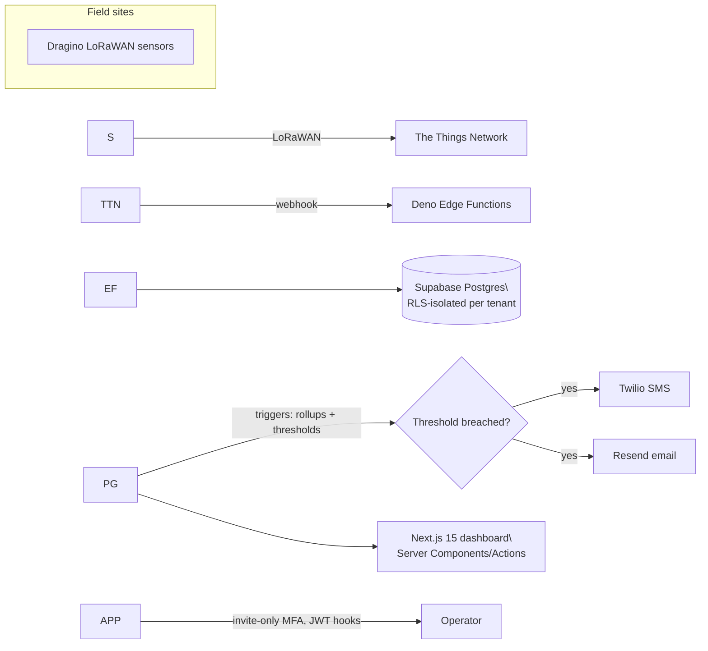

# Hi, I'm Purav Maloo

Cloud \& Network Engineer building multi-tenant SaaS and IoT telemetry systems. Currently the founding engineer at [Sensitii](https://sensitii.com), a compliance monitoring platform for restaurant and cold-chain operators.

**Dallas, TX** · [puravmaloo@gmail.com](mailto:puravmaloo@gmail.com) · [LinkedIn](https://linkedin.com/in/maloo1) · [Portfolio \& write-ups](https://personal-portfolio-theta-eosin-24.vercel.app/)

\---

## What I do

I came up through retail operations management, moved through cloud security (AWS IAM, SAP GRC), and now build the full stack for a live SaaS product — schema to Postgres RLS to serverless ingestion to the UI operators actually use. I care about systems that fail safely: tenant isolation that can't leak, alerts that fire before a walk-in cooler ruins a week of inventory, and infrastructure a small team can actually operate.

## Currently building — Sensitii

Multi-tenant compliance monitoring for restaurants and cold-chain sites: dashboards, threshold alerting, and audit-ready reporting that save operators 9+ hours a week. Live at [sensitii.com](https://sensitii.com); source now lives in a private org repo, but the full build write-up (architecture, RLS patterns, IoT pipeline) is public on my [portfolio](https://personal-portfolio-theta-eosin-24.vercel.app/).

Every table is Postgres RLS-scoped per tenant, auth runs through custom JWT hooks with invite-only MFA, and every sensitive action is captured by an audit RPC — that isolation model is the part of this project I'm proudest of.

## Pinned repos here

|Repo|What it is|Stack|
|-|-|-|
|[CakeFinder](https://github.com/1Puma/CakeFinder)|Upload a cake photo, get a buildable spec, find local decorators who can make it|Next.js 15, React 19, Prisma, Zod, Vercel AI vision|
|[Personal-Portfolio](https://github.com/1Puma/Personal-Portfolio)|This portfolio — live project write-ups with architecture, security controls, and lessons learned per post|React, Vite, Tailwind|

Older projects from my resume (LoRaWAN/edge CV pipelines, the AWS captive portal, inventory automation) no longer have their source in a repo here — most of that code was lost. The build write-ups for those survive on the [portfolio site](https://personal-portfolio-theta-eosin-24.vercel.app/) even where the repos didn't.

## Stack

**Languages** Python · TypeScript · SQL
**Web** Next.js · React · REST APIs · Tailwind
**Data** PostgreSQL · Supabase · Prisma
**Cloud/Infra** AWS (EC2, S3, RDS, IAM, VPC, CloudWatch, Route 53) · Docker · Vercel · Terraform
**AI/ML** Ollama · vLLM · Open WebUI · OpenCV · Vertex AI
**Security** Postgres RLS · MFA · IAM/RBAC · least-privilege access design · SoD analysis
**Automation** n8n · Twilio · Resend

## Certifications

AWS Certified Solutions Architect – Associate (SAA-C03) · Azure Administrator Associate (AZ-104) · CompTIA Security+ · CompTIA Network+ · CompTIA Cloud+ · CompTIA A+ · CompTIA Project+ · ITIL 4 Foundation

## Background

B.S. Cloud and Network Engineering, Western Governors University (2025). Before engineering: cloud security intern at SAPTech Integrators (AWS IAM architecture, SAP GRC/SoD remediation), and operations manager at Baskin Robbins, where I ran a 10-person team through a full store renovation and a 25% revenue increase — the same operational instincts that now shape how I build tools for people running physical locations.

